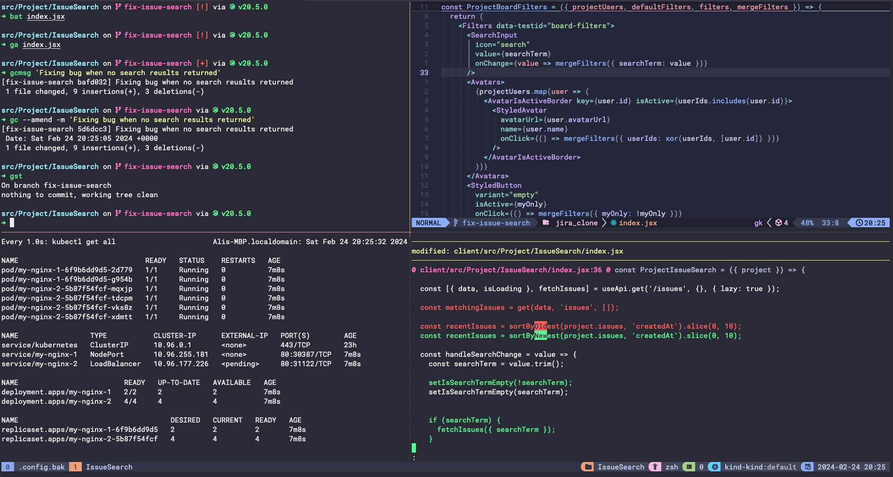

# dotfiles

These are my dotfiles. There are many others like them, but these ones are mine.
My dotfiles are my best friends. They are my life. I must master them as I must
master my life. Without me, my dotfiles are useless. Without my dotfiles, I am
useless.




## Quick Setup

Install [chezmoi](https://www.chezmoi.io/). See the [installation
docs](https://www.chezmoi.io/install/) on how to do this for your OS

Then simply run:

```bash
chezmoi init aliktb
```

This will clone this repo to `~/.local/share/chezmoi`

Check the content of the local repo. Then apply the config to your local machine:

```bash
chezmoi apply
```

> [!TIP]
> If you want to clone the repo and have the dotfiles applied to your home
> directory in one command, simply run:
>
> ```bash
> chezmoi init --apply aliktb
> ```
