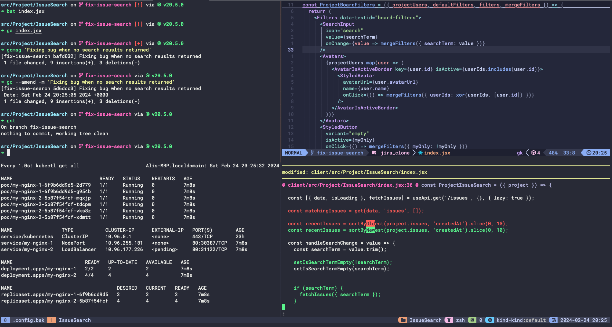

# dotfiles

My dotfiles config for my developer setup on MacOS.



## Quick Setup

Clone this repo into your home directory:

```bash
git clone https://github.com/aliktb/dotfiles ${HOME}/dotfiles
```

Run from terminal within macOS:

```bash
## Install Xcode Command Line Tools
xcode-select --install

## Install Homebrew
/bin/bash -c "$(curl -fsSL https://raw.githubusercontent.com/Homebrew/install/HEAD/install.sh)"
```

Install Oh my Zsh:

```bash
sh -c "$(curl -fsSL https://raw.githubusercontent.com/ohmyzsh/ohmyzsh/master/tools/install.sh)"
```

Once Brew is installed, run the following to install all applications listed in the [Brewfile](./Brewfile):

```bash
brew bundle
```

Install Tmux plugins:

```bash
git clone https://github.com/tmux-plugins/tpm ~/.tmux/plugins/tpm
```

Finally, get the dotfiles of this repo into your local machine. From the root of this repo, run:

```bash
stow .
```
